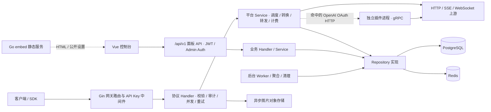
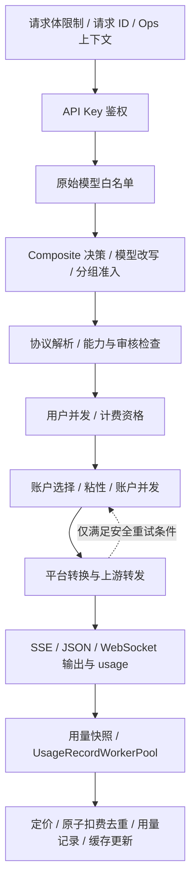

# Sub2API 架构与修改指南

> 本文是本项目理解、定位、修改和验证的总览与索引。先读本文和 [开发规范](DEVELOPMENT_RULES.md)，再沿源码入口进入对应领域。
>
> 首次核对日期：2026-09-29；代码基线：`9a62841fd124d026cf3694fcf9b79e98addcdbdc` 及本次文档/门禁变更。本文依据本地源码、测试、随仓库维护的官方 README 和领域文档编写；参考 maas 同名指南的组织方式，不继承其技术实现。
>
> **任何代码改动都必须在同一变更中更新本文的变更索引；影响现行架构、接口、路径或行为时，还必须更新对应正文。缺少索引、索引与代码不符或只改日期，一律阻断合入。**执行细则见开发规范 §19 和本文 §11。

路径约定：`backend/`、`frontend/` 等完整路径相对 **sub2api 仓库根目录**；表格标注的相对目录和本节已明确的目录可使用短路径/文件名。可点击链接相对本文所在的 `docs/`。路径和符号比行号稳定；定位后仍须阅读实现和相邻测试。正文描述当前实现，§11 记录变更历史，历史记录不替代正文。

## 1. 阅读地图与资料索引

| 要做什么 | 从哪里开始 |
| --- | --- |
| 第一次理解项目 | §2 总体架构 → §3 启动/鉴权 → §4 网关生命周期 → §5 数据与计费 |
| 修改请求、协议、模型或账户调度 | §4 → §8 修改速查 → 对应 handler/service 与测试 |
| 修改用户端或管理端 | §7 → §8 前后端关联 → §9 验证 |
| 修改支付、媒体、审计或插件 | §6 对应领域 → 下表专门文档 |
| 修改部署、配置或同步上游 | §3、§9、§10 → 开发规范与同步手册 |
| 完成任何代码修改 | 更新相关正文、§11 文件级变更索引，执行架构索引检查及受影响 Gate |

### 1.1 随仓库维护的文档

| 文档 | 用途与源码依据 |
| --- | --- |
| [README_CN.md](../README_CN.md)、[README.md](../README.md) | 官方项目能力、客户端接入和部署概览；能力需对照 `backend/internal/server/routes/`，不能把 README 赞助商广告当作项目功能。 |
| [DEVELOPMENT_RULES.md](DEVELOPMENT_RULES.md) | 强制开发规范、分层、不变量、验证门禁、索引维护与评审阻断项。 |
| [定制开发与上游同步手册](SUB2API_CUSTOMIZATION_AND_UPSTREAM_SYNC_GUIDE.md) | 本 Fork 的开发、上游合并和发布流程；当前分支/远端以 Git 实际状态为准。 |
| [DEV_GUIDE.md](../DEV_GUIDE.md) | 开发环境、工具链和常见问题；包含历史 Windows 环境示例，非统一部署配置，差异见 §10。 |
| [数据库迁移说明](../backend/migrations/README.md) | SQL 文件命名和校验和；实际执行器是 `backend/internal/repository/migrations_runner.go`，旧命令差异见 §10。 |
| [COMPOSITE_GROUPS.md](COMPOSITE_GROUPS.md) | 组合分组与路由规则；实现入口 `composite_route_resolver.go`，当前账号归属分支见 §4.3。 |
| [OpenAI 契约兼容性方案](SUB2API_OPENAI_CONTRACT_COMPATIBILITY_TECHNICAL_PLAN.md) | 2026-09-29 代码复核版：缓存身份与 usage 已有实现；stop、token 上限和工具选择的剩余缺口、分支边界与后续方案。文档完成不代表代码实施或真实上游验收完成。 |
| [ASYNC_IMAGE_TASKS.md](ASYNC_IMAGE_TASKS.md) | OpenAI/Grok 异步图片、对象存储、轮询和所有权；对应 `image_task_handler.go`、`service/image_task.go`。 |
| [BATCH_IMAGE_MVP.md](BATCH_IMAGE_MVP.md) | Gemini API/Vertex 批量图片、队列、冻结款、下载/清理；对应 `service/batch_image*.go`。 |
| [seedance-api.md](seedance-api.md) | Ark 原生视频接口与轮询结算；对应 `handler/seedance.go`、`service/seedance.go`。 |
| [PAYMENT_CN.md](PAYMENT_CN.md)、[PAYMENT.md](PAYMENT.md) | 内置支付配置与订单操作；对应 `routes/payment.go`、`service/payment*.go`、`internal/payment/`。 |
| [管理支付集成 API](ADMIN_PAYMENT_INTEGRATION_API.md) | 外部系统充值、兑换幂等和嵌入页参数；对应 `handler/admin/redeem_handler.go`、`service/idempotency.go`、`frontend/src/utils/embedded-url.ts`。 |
| [插件开发教程](PLUGIN_DEVELOPMENT.md)、[公开插件协议](../backend/pkg/pluginapi/README.md) | `.s2plugin`、进程协议和宿主边界；公开定义在 `backend/pkg/pluginapi/v1/`。 |
| [插件开发](../backend/pkg/pluginapi/docs/development.md)、[UI Bridge](../backend/pkg/pluginapi/docs/ui-bridge.md)、[包格式](../backend/pkg/pluginapi/docs/package-format.md)、[安全边界](../backend/pkg/pluginapi/docs/security.md) | 插件详细契约；宿主实现 `service/plugin_*.go`。 |
| [渠道监控默认值](channel-monitor-v2-safe-defaults.md) | V1/V2、低负载历史回填与错误去重；对应 `service/channel_monitor_v2_aggregator.go` 及 repository。 |
| [部署说明](../deploy/README.md)、[Docker](../deploy/DOCKER.md)、[边缘安全](../deploy/EDGE_SECURITY.md) | 二进制/容器部署、代理和安全配置；对照 `deploy/` 脚本、Compose 与配置样例。 |
| [中文合规正文](legal/admin-compliance.zh.md)、[英文合规正文](legal/admin-compliance.en.md) | 管理控制台实际展示内容，属于运行资源；对应 `middleware/admin_compliance.go` 及前端合规状态。 |
| [模型价格资源](../backend/resources/model-pricing/README.md) | 定价数据来源与维护；运行时 `service/pricing_service.go`、`model_pricing_resolver.go`。 |
| [前端路由](../frontend/src/router/README.md)、[stores](../frontend/src/stores/README.md)、[公共组件](../frontend/src/components/common/README.md)、[布局](../frontend/src/components/layout/README.md)、[认证页](../frontend/src/views/auth/README.md) | 局部开发说明；方法签名、守卫和状态字段以当前 TypeScript/Vue 实现为准。 |
| [Prompt Audit 变更资料](../openspec/changes/add-openai-compatible-prompt-audit/README.md) | 设计与实施资料入口；现行实现位于 `internal/securityaudit/`，设计中的计划不能视为运行事实。 |
| [入口拒绝日志清理工具](../backend/cmd/cleanup-ingress-reject-logs/README.md)、[发布辅助工具](../.github/release-tools/README.md) | 专项运维/发布工具，操作前读各自边界及脚本。 |

新增、迁移或删除领域文档时，必须更新本表或所属章节的链接。大方案、测试报告可另存文件，但本文必须留下可定位的入口及当前完成状态。

## 2. 项目总体架构

Sub2API 将平台生成的 API Key 请求分发到上游账户，负责鉴权、分组准入、调度、协议转换、并发、计量与计费，同时提供用户控制台、管理控制台和后台任务。

- 后端：单个 Go 模块，`backend/go.mod` 当前声明 Go **1.27.0**，Gin HTTP、Wire 装配、Ent 与原生 SQL；业务数据库为 PostgreSQL，Redis 承担缓存、计数、锁和任务队列等职责。
- 前端：`frontend/package.json` 中的 Vue 3、TypeScript、Vue Router、Pinia、Vite、Tailwind CSS 3、vue-i18n；包管理器 pnpm。CI 当前使用 Node 20、pnpm 9。
- 发布：Go 服务可通过 `embed` build tag 嵌入前端；普通后端构建与嵌入构建是不同产物。多实例正确性依赖共享数据库/Redis以及一致的必要密钥，不能仅靠进程内缓存。



图中是主干调用关系，不代表所有业务都严格经过 repository。支付服务已有直接使用 Ent 的事务实现；Prompt Audit 在独立包内持有自身存储实现。新增代码应遵守开发规范的所有权边界，不扩大历史耦合。

### 2.1 目录与所有权

| 入口 | 责任与修改边界 |
| --- | --- |
| [backend/cmd/server/](../backend/cmd/server/) | `main.go` 启动/退出、版本；`wire.go` 装配源与清理；`wire_gen.go` 生成接线。 |
| [backend/internal/server/](../backend/internal/server/) | `http.go` 服务/可信代理，`router.go` 总路由，`routes/` 分组，`middleware/` 鉴权、限制和日志。 |
| [backend/internal/handler/](../backend/internal/handler/) | 协议入口和面板 API，`admin/` 管理处理器、`dto/` 输出模型。 |
| [backend/internal/service/](../backend/internal/service/) | 业务规则、平台网关、调度、计费、仓储接口、后台服务；大文件按同前缀职责拆分。 |
| [backend/internal/repository/](../backend/internal/repository/) | Ent/PostgreSQL/SQL、Redis、HTTP 上游等接口实现，迁移执行与数据一致性。 |
| [backend/ent/schema/](../backend/ent/schema/)、[backend/migrations/](../backend/migrations/) | 手写 Ent schema 与前向 SQL 迁移；`backend/ent/` 其他大量文件是生成代码。 |
| [backend/internal/domain/](../backend/internal/domain/) | 平台/状态等共享常量；平台字符串来源 `constants.go`。 |
| [backend/internal/pkg/](../backend/internal/pkg/)、[backend/internal/util/](../backend/internal/util/) | 协议转换、平台工具、日志、URL/网络安全等；`apicompat/` 是重要转换入口。 |
| [backend/internal/config/](../backend/internal/config/)、[backend/internal/setup/](../backend/internal/setup/) | 配置加载/默认值/校验与首次安装。 |
| [backend/internal/securityaudit/](../backend/internal/securityaudit/) | 内容审核协调器与 Prompt Audit 的配置、扫描、存储、worker、管理 API。 |
| [backend/internal/payment/](../backend/internal/payment/) | 支付接口、注册表、负载均衡、金额工具与 `provider/`。 |
| [backend/pkg/pluginapi/](../backend/pkg/pluginapi/) | 对外插件协议、生成代码、SDK 与文档；不放 provider 私有实现。 |
| [backend/internal/web/](../backend/internal/web/) | `embed_on.go` / `embed_off.go`，静态路由、HTML 缓存与公开设置注入。 |
| [frontend/src/](../frontend/src/) | 页面、组件、API、类型、状态、语言与样式，详见 §7。 |
| [deploy/](../deploy/)、[Dockerfile](../Dockerfile) | 安装/容器/服务/反向代理配置与部署测试。 |
| [tools/](../tools/)、[.github/workflows/](../.github/workflows/)、[Makefile](../Makefile) | 本地质量检查与 CI/发布入口，详见 §9。 |

运行调用通常是 `route → handler → service → repository 实现`；编译依赖通过 service 定义的接口倒置，由 Wire 注入实现。`backend/.golangci.yml` 的 depguard 限制 handler/service 导入 repository、Redis 和 GORM，并存在少量明确白名单。新增依赖须同时检查 provider、构造器、测试 stub/mock。

## 3. 启动、配置与访问边界

### 3.1 启动和退出

实际入口：[main.go](../backend/cmd/server/main.go)。

1. 初始化 bootstrap 日志，读取版本和 `--setup` / `--version` 参数。
2. `setup.NeedsSetup()` 判断初始化状态：自动安装走环境配置；否则运行安装向导服务器。安装服务器与正常业务服务器的路由不同。
3. `runMainServer()` 加载 bootstrap 配置与日志，调用 Wire 生成的 `initializeApplication`。
4. `repository.InitEnt` 连接 PostgreSQL，运行嵌入的 SQL migrations，创建 Ent/SQL 客户端；Redis、业务服务、handler、中间件和 HTTP 服务经 provider 装配。部分后台服务在 `service/wire.go` 的 provider 中启动，不能只读 `main.go` 查找 worker。
5. 显式启动 PluginManager 和 Prompt Audit；降级语义见它们的 `Start` 和对应策略。随后 `ListenAndServe`。
6. 收到 SIGINT/SIGTERM 后执行 HTTP Shutdown，再调用 `Application.Cleanup`：停止应用层服务，最后关闭 Redis/Ent。增加后台任务必须接入启动、取消和清理，不能遗留 goroutine。

### 3.2 配置分为两类

| 配置类型 | 代码入口 | 修改时注意 |
| --- | --- | --- |
| 进程/部署配置 | `backend/internal/config/config.go`，`deploy/config.example.yaml`、`deploy/.env.example` | `CONFIG_FILE` 可指定文件；否则依次搜索 `DATA_DIR`、`/app/data`、当前目录、`./config`、`/etc/sub2api`。Viper 将点映射为下划线读取环境变量；新字段需注册默认值/绑定并验证环境可达性。 |
| 管理员持久化设置 | `backend/internal/service/setting_service.go` 及 `setting_*.go`、`backend/internal/handler/admin/setting_handler.go`、`backend/ent/schema/setting.go` | 不同设置有独立生效/缓存机制；保存后是否即时生效需核对订阅、失效回调和使用方，不能一概称需重启或热更新。 |
| 公开设置 | `GetPublicSettingsForInjection`、`backend/internal/web/embed_on.go`、`frontend/src/stores/app.ts` | 只暴露公开字段。前端启动前注入；保存设置时由 `server/router.go` 回调清除 HTML 缓存并更新 CSP 来源。 |

`run_mode=simple` 与“后台模式”是不同机制。前者改变计费/配额行为，并有可选的 Key 时间窗口计量；后者通过 `middleware/backend_mode_guard.go` 和前端路由控制用户界面/API 的可用性。不能把 simple 理解为取消认证。

### 3.3 路由与认证速查

总入口：[router.go](../backend/internal/server/router.go) 的 `SetupRouter` / `registerRoutes`。

| API 面 | 路由源文件（均在 `backend/internal/server/routes/`） | 认证/响应边界 |
| --- | --- | --- |
| 登录、刷新、注册与认证回调 | `auth.go` | 公开入口配限流；需登录的子路由使用 JWT。身份实现还需读 `service/auth*.go`。 |
| 用户控制台 `/api/v1` | `user.go` | JWT、用户状态/会话检查、面板限流与所有权；典型返回 `{code,message,data}`。 |
| 管理接口 `/api/v1/admin` | `admin.go` | Admin Auth 支持管理员 JWT 或管理员 `x-api-key`，还有管理审计/合规及部分敏感操作的 step-up。普通网关 Key 不是管理员 Key。 |
| 模型广场 | `model_plaza.go` | Optional JWT 与公开设置控制，不能因未登录可读而开放写操作。 |
| AI 网关 | `gateway.go` | API Key、分组/模型准入、协议特定错误结构；不套面板 envelope。 |
| 支付 | `payment.go` | 用户订单 JWT、管理接口 Admin Auth；webhook 不使用面板 JWT，而由支付验签与订单校验保护。 |
| 健康与通用入口 | `common.go` | 与业务鉴权不同；安装入口另见 `internal/setup/`。 |

关键中间件：`api_key_auth.go`、`api_key_auth_google.go`、`jwt_auth.go`、`admin_auth.go`、`session_binding.go`、`step_up.go`、`admin_compliance.go`、`panel_rate_limit.go`。可信代理在 `server/http.go`，客户端 IP 解析影响登录绑定、限流和审计；修改时一起核对 `deploy/EDGE_SECURITY.md`。

## 4. 网关请求处理与修改位置

### 4.1 典型同步请求生命周期

以下是主干，不是所有媒体/原生接口共享的单一函数：



源码证据：`routes/gateway.go` 的 middleware 注册顺序；`handler/gateway_handler.go` 的 `Messages`；`handler/openai_gateway_handler.go` 的 `Responses`；`service/gateway_forward.go`、`openai_gateway_forward.go`；`service/gateway_usage_billing.go`、`usage_record_worker_pool.go`。

Handler 不只是参数转发：这里维护请求快照、平台归属、并发释放、失败账户集合、流是否已经输出以及用量提交。服务返回“错误 + 部分 usage”时也可能需要计费，不能仅在 `err == nil` 时记录。

### 4.2 协议入口和平台实现

| 客户端入口 | 主要 handler / service（相对 `backend/internal/`） |
| --- | --- |
| `POST /v1/messages`、`/messages/count_tokens` | 按分组平台进入 `handler/gateway_handler.go` 或 `handler/openai_gateway_handler.go` / `handler/openai_gateway_count_tokens.go`；服务 `gateway_forward.go`、`openai_gateway_messages*.go`、`gateway_count_tokens.go`。 |
| `POST /v1/responses`、`/v1/chat/completions` | `handler/openai_gateway_handler.go`、`handler/openai_chat_completions.go`，或 `gateway_handler_responses.go` / `gateway_handler_chat_completions.go`；服务为对应 `openai_gateway_*` 和 `gateway_forward_as_*.go`。 |
| `GET /v1/responses`、Live、Realtime | OpenAI handler 中对应 WebSocket/Live 路径；从 `routes/gateway.go` 的方法绑定定位，不能把 GET 与 POST Responses 混为一个入口。 |
| `/v1beta/models/*modelAction` | `handler/gemini_v1beta_handler.go`，Gemini 原生转发与 Antigravity 分支；Gemini 的模型在 URL 中而非始终在 JSON 中。 |
| `/v1/models`、`/v1/models/:model` | `Gateway.Models`；列表带 `client_version` 时会分发到 Codex manifest，单模型查询不走该分支。 |
| `/v1/embeddings`、图片、视频、语音、搜索 | `routes/gateway.go` 为每类接口选择 OpenAI/Grok/其他受支持分支；同属 OpenAI 兼容平台不等于支持全部端点。 |
| `/api/v3/contents/generations/tasks` 等 | `handler/seedance.go`；独立的 Ark 原生任务契约，见 §6。 |

`gateway.go` 还注册无版本前缀别名、Codex 专用路径和强制 Antigravity 路径。增加或改动一条路径，必须同步检查别名、原始模型准入、Ops 归一化和审计覆盖，不能只改 `/v1`。

平台标识见 `backend/internal/domain/constants.go`：Anthropic、OpenAI、Gemini、Antigravity、Grok、Kimi、Zhipu、DeepSeek、MiniMax、OpenCode Go，以及组合层 `composite`。平台标识、账号凭据类型、客户端协议是三个不同维度。实际分支还受账户端点能力、Base URL、模型映射和功能开关控制。

### 4.3 分组、模型和调度

- **API Key → Group**：`ent/schema/api_key.go` 的可空 `group_id`；Group 决定访问/定价/订阅等边界。**Account ↔ Group** 经 `account_group.go` 关联；账号承载上游凭据、平台、代理、权重/优先级和可调度状态。
- **Channel**：`service/channel*.go`、`repository/channel_repo*.go` 管理渠道模型映射/价格等，不应把 Channel 与 Account 当作同一实体。
- **Composite**：`service/composite_route_resolver.go::Resolve` 顺序是显式路由 → 已装配的账号模型归属解析 → 内置 `DetectModelPlatform`。`gateway_service.go` 注入归属 resolver；归属歧义拒绝，归属查询失败时仅可识别模型允许检测兜底。显式规则按 exact、具体 endpoint、最长 prefix、较小 priority、较小 ID 决胜。
- **模型准入**：`middleware/group_model_allowlist.go` 在 API Key 鉴权之后、Composite 改写之前读取客户端原始模型；调整映射不得绕过白名单。
- **调度**：`service/gateway_scheduling.go`、`openai_gateway_scheduling.go`、`openai_account_scheduler.go`，结合 `scheduler_snapshot_service.go`、`scheduler_outbox.go` 和 repository 缓存实现。需同时考虑平台/分组、模型、账户状态、粘性会话、负载、限流、利润约束与失败集合。
- **并发**：`handler/gateway_helper.go`、`service/concurrency_service.go`、`repository/concurrency_cache.go`。用户槽位、账户槽位和等待是不同层；所有失败/取消路径都要释放。

一次调用中必须区分客户端模型、路由改写模型、账户上游模型和计费模型。Composite 决策中的具体平台还进入配额、渠道映射、账单和 Ops；不要把字符串 `composite` 当作实际提供方。

### 4.4 请求构造、转换、出站和流

| 要改的行为 | 优先阅读的实现 |
| --- | --- |
| Anthropic 出站 URL、认证头、beta 与 body 一致性 | `service/gateway_upstream_request.go`、`gateway_claude_oauth_body.go`、`gateway_anthropic_passthrough.go`、`gateway_bedrock.go`。 |
| OpenAI Responses 构造、请求字段净化、子路径 | `service/openai_gateway_forward.go`、`openai_gateway_request_body.go`、`upstream_path_guard.go`。 |
| Messages / Responses / Chat Completions 转换 | `internal/pkg/apicompat/` 的具体方向转换器；再追踪调用它的 `service/openai_gateway_messages*.go`、`openai_gateway_chat_completions*.go`、`gateway_forward_as_*.go`。 |
| Gemini/Antigravity 转换与流 | `service/gemini_messages_compat*.go`、`antigravity_gateway_gemini.go`、`antigravity_gateway_claude.go`、`antigravity_gateway_streaming.go`、`antigravity_gateway_compat*.go`。 |
| Grok 协议桥、工具和媒体 | `service/openai_gateway_grok*.go`，以及路由指向的 Grok handler。 |
| HTTP 连接池、代理、压缩、TLS 指纹 | `repository/http_upstream.go`、`internal/pkg/tlsfingerprint/`、`internal/util/urlvalidator/`；接口与实际实现一起看。 |
| OpenAI OAuth 插件接管 | `service/openai_plugin_transport.go` 的 `doOpenAIUpstream`，详见 §6.4。 |
| SSE 解析、工具 ID/参数、结束事件、usage | `service/gateway_upstream_response.go`、`openai_gateway_response_handling.go`、对应 `apicompat/*stream*.go`；重试决策还在 handler。 |

不是所有请求都先转换成统一 DTO：透传、原生 Anthropic、Responses/Chat fallback 和各平台兼容分支各有边界。修复字段时沿“入站解析 → 分支选择 → 实际出站 body → 响应转换 → usage”追踪，避免只改未被调用的转换器。

流式/重试的关键验证：事件顺序、工具调用关联、结束标记、usage 缺失/中断、客户端取消、首输出超时；已产生下游可见输出后不能盲目换账户重放。连接是否已发送、是否已输出和业务是否可重复是不同条件。

## 5. 持久化、缓存与计费

### 5.1 数据模型导航

| 领域 | 手写模型入口（`backend/ent/schema/`） | 服务/存储入口 |
| --- | --- | --- |
| 用户、身份与会话 | `user.go`、`auth_identity.go`、`pending_auth_session.go` | `service/auth*.go`、`user_service.go`、`repository/user_repo.go` |
| Key、分组、账户、代理 | `api_key.go`、`group.go`、`account.go`、`account_group.go`、`proxy.go` | `service/api_key_service.go`、`gateway_scheduling.go`、相应 repository |
| 订阅、平台配额 | `user_subscription.go`、`subscription_plan.go`、`user_platform_quota.go` | `service/subscription_service.go`、`gateway_usage_billing.go` |
| 用量与清理 | `usage_log.go`、`usage_cleanup_task.go` | `service/usage_service.go`、`repository/usage_log_repo*.go` |
| 设置与组合路由 | `setting.go`、`composite_model_route.go` | `setting_service.go`、`composite_route_resolver.go`、`composite_model_route_repo.go` |
| 支付 | `payment_order.go`、`payment_provider_instance.go`、`payment_audit_log.go` | `service/payment*.go`、`internal/payment/` |
| 批量图片 | `batch_image_job.go`、`batch_image_item.go`、`batch_image_event.go` | `service/batch_image*.go`、`repository/batch_image_repo.go` |

不是所有表都由 Ent schema 表示：例如计费去重、插件及审计等还使用 SQL migration/专属存储实现。修改表之前同时搜索 `backend/migrations/` 和 SQL 调用点，不能只看 Ent 目录。

### 5.2 定价与结算路径

1. Handler 获取请求时刻、模型/渠道/具体平台及用户快照；`BillingCacheService.CheckBillingEligibility` 检查调用资格。
2. 平台转发结果携带 token、缓存、图片/视频等实际 usage。`UsageRecordWorkerPool` 接收必要快照，不应持有整个 Gin context 或大请求体。
3. `service/gateway_usage_billing.go`、`openai_gateway_usage.go` 组织记录；`billing_service.go`、`pricing_service.go`、`model_pricing_resolver.go` 处理价格/倍率/模型归属；另有 service tier、reasoning、媒体计费文件。
4. `service/usage_billing.go` 定义 `UsageBillingCommand`、请求指纹和 **8 位金额量化**。指纹生成与金额量化顺序有兼容意义。
5. `repository/usage_billing_repo.go::Apply` 在一个事务中领取 `(request_id, api_key_id)` 去重键并应用金额/配额副作用，重复指纹不重复执行，冲突指纹报错；随后处理用量日志与缓存更新等。**原子扣费不代表所有异步日志和缓存写入都在同一事务内。**

修改价格或计费字段须同步：请求模型/计费模型、前端展示与类型、价格来源、历史统计、金额量化、订阅与余额路径、Key 配额、缓存失效、重复请求和失败恢复。不得把 `gateway_usage_billing.go` 的 legacy fallback 当成生产统一事务主路径。

### 5.3 缓存与数据库演进

Redis 入口 `repository/redis.go`，具体用途分散在 `billing_cache.go`、`gateway_cache.go`、`scheduler_cache.go`、`concurrency_cache.go`、`image_task_store.go`、`batch_image_queue.go` 等。认证缓存失效还有 outbox/worker；数据库成功不等于其他实例的缓存已更新，修改禁用/配额/分组时须检查对应失效链。

数据库升级由 `repository/ent.go` 调用 `migrations_runner.go`，嵌入来源 `backend/migrations/`。普通迁移事务执行，`*_notx.sql` 用于并发索引，SHA256 记录防止历史迁移被静默修改。不能依靠修改 Ent schema 自动升级旧库；必须新增前向 SQL、生成 Ent、补 repository/DTO/UI 并验证空库和旧库。

## 6. 专项业务与后台任务

### 6.1 三类异步媒体不能混用

| 链路 | 代码入口（`backend/internal/`） | 状态与计费边界 |
| --- | --- | --- |
| OpenAI/Grok 异步图片 | `handler/image_task_handler.go`、`service/image_task.go`、`repository/image_task_store.go` | 默认关闭且要求对象存储完整；复用同步图片处理。Redis 保存紧凑任务状态，图片上传对象存储后移除 base64。轮询绑定用户与提交 Key；关新提交后仍可轮询。不是持久化批量 worker 队列。 |
| Gemini 批量图片 | `handler/batch_image_handler.go`、`service/batch_image_worker_runtime.go`、`batch_image_processor.go`、`batch_image_settlement.go`、`repository/batch_image_queue.go` | PostgreSQL 是状态来源，Redis 负责领取/锁/延迟重试；`gemini_api` 和 `vertex` provider 分开。提交冻结款、成功项结算、失败释放；结果由本网关代理下载。 |
| Seedance 视频 | `handler/seedance.go`、`service/seedance.go` | Ark 原生 `content[]`；显式启用端点能力的 OpenAI API Key 账号；任务绑定原用户/Key/分组/账号，Redis 保存模型快照。创建不扣 token、成功查询才按 completion tokens 结算；当前没有后台轮询结算。 |

Grok 视频/语音另在 `openai_gateway_grok*.go` 相关链路，不能套用 Seedance 的 token 计价或批量图片冻结款流程。异步任务改动至少核对所有权、重复执行、超时、取消、部分成功、存储清理与计费恢复。

### 6.2 支付、订阅和外部充值

路由 `server/routes/payment.go` → `handler/payment_handler.go` / `payment_webhook_handler.go` / `handler/admin/payment_handler.go` → `service/payment*.go` → `internal/payment/`。

支付提供方实现位于 `internal/payment/provider/`，包括 EasyPay、Alipay、Wxpay、Stripe、Airwallex；可用性取决于配置和注册。`payment_fulfillment.go` 将通知校验与履约联系起来，已有余额/订阅履约；支付成功和履约完成不是同一状态。修改需覆盖金额/币种/提供方核对、重复通知、履约租约与中断恢复。

外部系统的创建兑换接口在 `handler/admin/redeem_handler.go`，业务兑换码与 HTTP 幂等键不是一回事。`service/idempotency.go` 的 `ObserveOnly` 会改变缺键时的行为，不能只依据 API 文档判断必定拒绝。前端 `api/payment.ts`、`stores/payment.ts`、`views/user/Payment*.vue` 与 `views/admin/orders/` 分别处理用户支付和后台订单。

### 6.3 审计、监控和安全

- **请求审核**：`internal/securityaudit/coordinator.go::Check` 协调 legacy moderation 与 Prompt Audit；模式为 off/async/blocking。异步队列使用请求副本，阻断模式有独立故障策略。配置、scanner、payload 存储、worker、事件存储均在同包；UI 为 `frontend/src/features/prompt-audit/`。接入新协议必须查 `server/routes/prompt_audit_route_coverage_test.go` 及对应 handler 的调用。
- **Ops 与入口拒绝**：`handler/ops_error_logger.go`、`service/ops*.go`、`middleware/ingress_reject.go` / `ops_ingress_reject.go` 相关服务；管理页面 `frontend/src/views/admin/ops/`。排查时区分入口拒绝、本地业务限制和上游错误，不记录凭据或完整敏感正文。
- **渠道监控**：`service/channel_monitor_v2.go`、`channel_monitor_v2_aggregator.go` 和相应 repository；用户页 `ChannelStatusView.vue` 选择 V1/V2，公共 V2 组件在 `features/channel-monitor-v2/`。当前默认/历史回填边界查领域文档与实现，不能擅自全量高频重算。
- **管理审计与合规**：`service/audit_log*.go`、`middleware/audit_log.go`、`admin_compliance.go`，前端 `stores/adminCompliance.ts`；法律 Markdown 是实际产品输入，必须同步双语、版本与确认测试。

### 6.4 插件不是通用业务适配器

`service/plugin_manager.go` 管理安装、签名、版本兼容、启停、灰度及多实例协调；`plugin_runtime.go` 管理进程；`plugin_package.go` / `plugin_manifest.go` 处理包。公开协议 `backend/pkg/pluginapi/v1/plugin.proto`，UI 入口 `frontend/src/views/admin/PluginsView.vue` 与 `api/admin/plugins.ts`。

当前传输能力 `openai.oauth.outbound_transport.v1` 只接管命中的 OpenAI OAuth 上游 HTTP；`openai_plugin_transport.go` 返回标准 HTTP Response，SSE 解析、错误映射、调度和计费仍由宿主负责。API Key 账号和 OAuth 登录/token 刷新不自动进入插件。插件进程不是操作系统沙箱。

### 6.5 新增后台服务的接线检查

先搜索 `service/wire.go` 的 provider，再看 `cmd/server/wire.go::provideCleanup`，最后核对 `wire_gen.go`。现有后台职责包括令牌刷新、账户/代理/订阅到期、调度快照、用量 worker、计费缓存、批量图片、Ops/渠道聚合、备份、订单过期和插件协调等。新增任务需明确：启动开关、单实例/多实例锁、取消、重试上限、持久进度、资源回收和关闭顺序。

## 7. 前端结构与修改指南

### 7.1 启动和数据流

`frontend/src/main.ts` 初始化主题 → Vue/Pinia → `appStore.initFromInjectedConfig()` → i18n → Router → 等待初始导航后挂载 `App.vue`。公开设置在前端挂载前进入 store，减少品牌/功能开关闪烁。

```text
router/index.ts → views/ 或已有 features/ 页面 → components/ + composables/
                                           → api/ 模块 → api/client.ts → /api/v1
                                           ↔ stores/ (Pinia) + types/
```

| 目录/文件（相对 `frontend/`） | 修改入口 |
| --- | --- |
| `src/router/index.ts`、`meta.d.ts`、`title.ts` | 集中路由、懒加载、标题和守卫；没有文件式路由自动注册。 |
| `src/views/auth/`、`setup/`、`user/`、`admin/` | 登录/安装/用户/管理页面；新页面通常先定位这里。 |
| `src/features/prompt-audit/`、`channel-monitor-v2/` | 已形成的领域模块；不能据此假设所有功能都放在 features。 |
| `src/components/layout/` | `AppLayout.vue`、`AppSidebar.vue`、`AppHeader.vue`、`AuthLayout.vue`、`TablePageLayout.vue`。 |
| `src/components/common/` 及 account/group/keys 等领域目录 | 公共交互与复杂表单，改已有页面前先查是否可复用。 |
| `src/composables/` | `useTableLoader`、`useKeyedDebouncedSearch`、OAuth、step-up 等复用逻辑。 |
| `src/stores/` | auth、app、subscriptions、payment、adminSettings、adminCompliance 等共享状态。 |
| `src/api/client.ts`、`tokenRefresh.ts`、`url.ts` | 面板 HTTP 客户端、并发刷新、API/网关地址构造。 |
| `src/types/` | 共享类型；部分领域 API 文件还声明局部接口，修改字段需搜索所有调用方。 |
| `src/i18n/`、`src/style.css`、`src/styles/`、`tailwind.config.js` | 双语模块、全局与领域样式、主题；以实际 Tailwind 3 配置为准。 |

### 7.2 路由和 API 契约

路由守卫默认要求认证（`requiresAuth !== false`），管理员路由显式 `requiresAdmin`；还检查后台模式、合规确认和部分功能开关。侧栏入口也需同步功能/权限，但前端隐藏入口不能代替后端授权。

面板 API 复用 `apiClient`：带认证、语言和查询时区、管理/用户 UI 标记，解包 `{code,message,data}`，统一刷新及 423 合规/功能关闭等错误处理。网关 SSE/WebSocket 与支付第三方 SDK 有独立传输场景，不能向上游或第三方发送面板会话。

### 7.3 新页面或字段的标准步骤

1. 在 `router/index.ts` 找相邻路由、访问条件和页面；在 `AppSidebar.vue` 找菜单。
2. 在对应 `api/` 模块定义请求与响应类型，核对后端 routes → handler/DTO → service 字段及零值语义。
3. 页面复用布局、表格、弹窗和 composables；跨页状态才放 store。处理加载、空、失败、无权限、提交中与重复提交。
4. 同步 `src/i18n/locales/zh/` 与 `en/` 对应模块，检查主题、移动端、键盘和页面标题。
5. 做受影响 Vitest/类型/lint/build 验证，并实际检查 UI；更新本指南相应地图及 §11。

### 7.4 页面与后端关联速查

| 功能 | 前端入口（`frontend/src/`） | 后端入口（`backend/internal/`） |
| --- | --- | --- |
| 用户 Key | `views/user/KeysView.vue`、`api/keys.ts`、`components/keys/` | `server/routes/user.go`、`handler/api_key_handler.go`、`service/api_key_service.go` |
| 上游账户/凭据/模型映射 | `views/admin/AccountsView.vue`、`api/admin/accounts.ts`、`components/account/`、OAuth composables | `handler/admin/account_handler.go` 与各 OAuth handler、`service/account*.go`、平台调度服务 |
| 分组/Composite | `views/admin/GroupsView.vue`、`api/admin/groups.ts`、`components/group/` | `handler/admin/group_handler.go`、`service/composite_route_resolver.go`、`repository/group_repo.go` |
| 渠道/模型价格 | `views/admin/ChannelsView.vue`、`api/admin/channels.ts` | `handler/admin/channel_handler.go`、`service/channel*.go`、`repository/channel_repo*.go` |
| 使用记录/仪表盘 | `views/user/UsageView.vue`、`views/admin/UsageView.vue`、相应 Dashboard 和 usage API | `handler/usage_handler.go`、`handler/admin/usage_handler.go`、`repository/usage_log_repo*.go` |
| 系统设置/品牌 | `views/admin/SettingsView.vue`、`stores/app.ts`、`api/admin/settings.ts` | `handler/admin/setting_handler.go`、`service/setting_service.go`、`web/embed_on.go` |
| 订阅/订单 | `views/user/SubscriptionsView.vue`、`PaymentView.vue`、`views/admin/orders/` | `routes/payment.go`、`service/subscription_service.go`、`payment_fulfillment.go` |
| 备份/异步图片存储 | `views/admin/BackupView.vue`、`api/admin/backup.ts` | `handler/admin/backup_handler.go`、`service/backup*.go`、`service/image_task.go` |
| 插件/审计/渠道监控 | §6 对应页面与 API | §6 专属服务及管理路由 |

## 8. 常见修改场景与最小联动范围

| 场景 | 先改哪里 / 必须追踪哪里 | 至少验证什么 |
| --- | --- | --- |
| 修复上游字段丢失/不兼容 | §4.4 真实协议分支、请求体修改顺序、原生/转换/透传路径 | 实际出站 JSON、流式/非流式、工具/推理/usage、错误与重试 |
| 新增模型或修改模型映射 | 平台模型定义、账户映射/能力、白名单、Composite、渠道价格、模型列表和表单 | 原始模型准入、分组/平台选择、上游模型、展示与计费模型一致 |
| 修改调度或故障转移 | §4.3 调度器、快照/outbox、并发、handler 的失败状态与输出检查 | 粘性/负载/无账户、限流、取消、已输出时不重放、槽位释放 |
| 新增平台/端点 | domain 常量、routes、handler/service、凭据、能力、转换、调度、usage、UI | 按真实支持范围声明端点；认证/权限/计费/审计/别名全链路 |
| 改计费/价格 | §5.2，价格资源、倍率、模型、结算 SQL 与报表 | 8 位精度、重复/冲突请求、余额/订阅/Key 配额、simple 与缓存 |
| 改数据库字段 | schema + 新 migration + Ent 生成 + repository + DTO/TS/UI | 空库/升级/空值/旧数据、事务及回滚兼容、生成 diff |
| 新增面板 API | routes + handler/DTO + service + 实现/装配 + 前端 API | 认证/资源归属、envelope、分页/过滤/错误、幂等与缓存 |
| 新增运行配置/开关 | config 默认值/环境注册、配置样例、setting/缓存、DTO、前端表单 | 缺省/关闭/升级兼容、持久化与实际生效、秘密不外泄 |
| 改 UI / 导航 / 品牌 | §7 页面/布局/store/双语；公开设置还关联 Vite/Go HTML 注入 | 权限、主题/视口、加载错误、刷新、构建与 HTML 缓存 |
| 改媒体任务/支付/插件 | §6 专属路径 | 领域文档中的所有权、状态机、重试、持久化与费用边界 |
| 改构建/部署/自动提交 | §9 Makefile、Dockerfile、workflow/脚本及版本来源 | 真正执行受影响脚本/测试，产物形态正确，机器人提交也留下 §11 索引 |

定位建议（在仓库根执行）：

```bash
rg -n 'RegisterGatewayRoutes|RegisterAdminRoutes' backend/internal/server
rg -n 'SelectAccount|RecordUsage|CheckBillingEligibility' backend/internal/handler
rg -n '目标字段或函数名' backend/internal frontend/src
rg --files backend/internal frontend/src | rg '(test\.go|spec\.ts)$'
```

## 9. 构建、测试、发布与索引门禁

### 9.1 开发与构建

先按 `deploy/config.example.yaml` 配置本地 PostgreSQL/Redis 和安装流程；不要将 `DEV_GUIDE.md` 的历史本机凭据当默认安全配置。工具链以 `backend/go.mod`、`frontend/package.json`、workflow 为准。

```bash
# 以下从 sub2api 仓库根执行；后端与前端 dev 在不同终端运行
pnpm --dir frontend install --frozen-lockfile
(cd backend && go run ./cmd/server)
pnpm --dir frontend run dev

# 后端普通构建 / 前端构建
make -C backend build
make build-frontend

# 修改 schema / Wire 后生成（按影响选择）
(cd backend && go generate ./ent)
(cd backend && go generate ./cmd/server)

# 完整嵌入构建：必须先生成前端，再编译 embed 变体
pnpm --dir frontend run build
(cd backend && CGO_ENABLED=0 go build -tags embed -o bin/server ./cmd/server)
```

Vite 默认开发端口 `3000`、代理目标 `http://localhost:8080`，可由 `VITE_DEV_PORT` / `VITE_DEV_PROXY_TARGET` 配置；当前代理 `/api`、`/v1`、`/setup`。其他网关原生路径需直接请求后端或显式配置代理。前端输出到 `backend/internal/web/dist`，不是 `frontend/dist`。

根 `make build` 按现有 Makefile 分别构建后端与前端，后端目标没有 `-tags embed`，因此**不是完整嵌入发行构建**。本地上例用于验证嵌入形态；正式版本/commit/date/BuildType 注入以 Dockerfile、发布 workflow 和 `backend/scripts/resolve-version.sh` 为准。

### 9.2 测试入口及真实覆盖范围

| 命令 | 覆盖范围 |
| --- | --- |
| `make -C backend test-unit` | `go test -tags=unit ./...`。 |
| `make -C backend test-integration` | `go test -tags=integration ./...`；需对应 PostgreSQL/Redis/testcontainers 环境。 |
| `make -C backend test` | 普通 `go test ./...` + golangci-lint；不等于所有 build tag 测试。 |
| `make test-frontend` | lint:check、typecheck、根 Makefile 指定的 critical Vitest 子集。 |
| `pnpm --dir frontend run test:run` | 全套 Vitest 一次运行。 |
| `pnpm --dir frontend run check:i18n` | 双语键完整性；build 也会先执行此检查。 |
| `(cd backend && go test -tags embed ./internal/web)` | 已生成前端资源时，验证静态路由/注入/缓存等 embed 行为。 |
| `make check-architecture-index` | 工作区与 HEAD 比较（含未跟踪且未忽略文件），校验代码修改已在本指南新增索引。 |
| `python3 -B -m unittest discover -s tools -p 'test_check_architecture_index.py'` | 门禁本身的临时 Git 仓库回归。 |

按 [开发规范](DEVELOPMENT_RULES.md) §17 选择必需 Gate；文档核对不能代替业务验证，编译成功不能代替运行测试，云端/插件/支付的未运行集成不得标为通过。

### 9.3 CI 与执行边界

- `backend-ci.yml`：架构索引检查、部署脚本测试、Go unit/integration/lint、前端关键测试、发布辅助测试。架构索引 job 使用完整 Git 历史；PR 比较 merge-base 到 PR head，push 比较事件 before 到 head，新分支按默认分支共同祖先选择基线。
- `security-scan.yml`：govulncheck、pnpm audit 与例外检查；gosec 在后端 lint 配置中。
- `release.yml`：发行构建及版本同步。自动更新 `backend/cmd/server/VERSION` 时也更新 §11 并执行索引检查，不豁免机器人或生成文件。

检查实现为 `tools/check_architecture_index.py`：代码/配置/资源/脚本/锁文件/CI/生成文件/测试发生变化时，要求本指南的索引区有**本次新增行**逐文件记录。重命名须覆盖旧、新路径，删除须保留被删路径的记录；只有正文里早已出现文件名不能通过。纯说明 `.md` 文件通常不触发代码门禁，但 `docs/legal/` 是运行资源，不豁免。新增说明文档仍须按规范维护 §1 的语义索引。

本地可按提交范围或暂存区检查：

```bash
python3 tools/check_architecture_index.py --base <基线提交> --head HEAD
python3 tools/check_architecture_index.py --staged
make check-architecture-index
```

自动检查只能证明“变更路径有新增索引”，不能判断说明是否正确；评审必须核对正文、行为和验证记录。托管平台是否将 `architecture-index` 设为必需状态检查属于远端分支保护配置，不能由仓库 YAML 单独保证；本规范要求维护者将其配置为必需检查，禁止绕过失败结果合入。

## 10. 已核对的文档差异与维护原则

| 旧描述/易误解处 | 当前依据与处理方式 |
| --- | --- |
| maas 的 React、GORM、多数据库、relay adaptor/relaykit 布局 | 本项目实际是 Vue/Gin/Ent/PostgreSQL，平台网关在 `internal/service/`，没有对应的 relaykit 独立模块。 |
| Composite 文档只列显式规则和内置检测 | 当前 `Resolve` 还有账号模型归属分支，见 §4.3；新增平台以 constants、验证函数和路由实现为准。 |
| 迁移 README 中 `make migrate-up/down`、Down 示例建议 | 当前 backend Makefile 没有这些目标；runner 执行完整 SQL，不解析 goose Up/Down。使用新增前向迁移并验证实际启动升级。 |
| 支付旧表把内置订阅列为计划 | `payment_fulfillment.go` 已有订阅履约，Composite 订阅也有链路；不据旧表重复实现。 |
| 插件教程 Go 1.21、示例 build/keygen 工具 | 宿主要求以 `backend/go.mod` 为准；教程示例不等于仓库已提供可安装包/完整示例工程。 |
| DEV_GUIDE 的本机路径、Fork 地址、旧 CI 摘要 | 环境示例不构成部署契约；工作流和 Git remote 才是当前依据，分支/同步按专门手册。 |
| “异步”意味着可靠跨重启恢复、“所有接口都支持所有平台” | 三类任务与每个 endpoint 分别判断，见 §4.2、§6.1；不得从名称推断能力。 |

发现新的差异时，本次变更必须修订本指南受影响描述，并将需要长期维护的领域说明同步修正。计划、已实现、离线测试通过、真实上游验证通过要明确区分。不得仅更新基线日期而保留失效路径。

## 11. 强制变更索引

本节记录**本指南建立之后**的变更，不伪造基线之前的开发历史。每个独立变更记录日期/标识、原因与最终行为、受影响源码路径、关联章节/领域文档、实际验证和限制。所有变更代码路径必须以反引号中的仓库相对完整路径写在本次新增索引行内；批量生成文件可在同一记录分多行列出，但不得仅写目录或通配符代替。

历史索引保留追溯信息；移动/删除后修订正文入口，历史条目注明替代位置。验证结果可链接专门报告。索引不是代码 diff 的全文复制，也不能用“杂项”“同上”“已同步”替代行为说明。

<!-- architecture-change-index:start -->

### 2026-09-29 · ARCH-001 · 建立架构总览与强制索引门禁

- 原因与行为：基于本地代码建立 §1–§10 总览、模块/前后端/领域入口、修改和验证指南；开发规范将任意代码改动同步本文设为强制要求。新增本地与 CI 路径覆盖检查，发布机器人同步版本时也留下索引。
- 规范与入口：`docs/ARCHITECTURE_AND_MODIFICATION_GUIDE.md`、`docs/DEVELOPMENT_RULES.md`、`DEV_GUIDE.md`。
- 门禁实现与测试：`tools/check_architecture_index.py`、`tools/test_check_architecture_index.py`；接线：`Makefile`、`.github/workflows/backend-ci.yml`、`.github/workflows/release.yml`。
- 关联章节：§9 描述命令与自动化实际覆盖；开发规范 §19 定义同步责任，§20/§21 定义合入阻断与完成清单。
- 验证：门禁临时 Git 仓库回归 **11/11 通过**；工作区索引检查覆盖 **6 个代码/配置路径**（含既有 `.gitignore`）；三份入口/规范文档 **93 个本地链接**、显式源码路径和 Markdown 结构核对通过；两个 workflow YAML 解析及 **29 个 run 片段**的 Bash 语法检查通过。发布同步片段已在临时 Git 仓库实际执行，版本写入/索引门禁通过，重复同版本不新增条目；`git diff --check` 通过。未运行 Go/前端业务、真实发布或远端分支保护验证。

### 2026-09-29 · BASELINE-LOCAL · 接入任务开始前已有的本地规范工作

- 范围：`.gitignore` 与 `docs/SUB2API_CUSTOMIZATION_AND_UPSTREAM_SYNC_GUIDE.md` 是任务开始前已有工作区改动，本次不改写它们；`docs/DEVELOPMENT_RULES.md` 也是既有未跟踪文档，本次在其原内容上增加架构索引约束。
- 当前行为：`.gitignore` 允许文档/脚本/测试进入版本管理，忽略本地配置、缓存、构建产物与本地工作目录；同步手册提供本 Fork 上游维护流程。记录用于让当前待提交变更可由总览定位，不追认其历史业务验证。

### 2026-09-29 · DOC-OPENAI-CONTRACT-002 · 按当前代码修订兼容性方案

- 原因与行为：旧方案沿用早期缓存、工具错误和单一 OAuth 路径假设；按 `b4a9452a68d494c85ee3a1da9bfc0128c2d1da9a` 核对后，将已有缓存派生/隔离/usage 能力转为回归项，撤销整响应缓存及伪造 token 用量设计，重新定义 stop、token 原值/不支持限制、工具选择校验的后续实施范围。
- 文档路径：`docs/SUB2API_OPENAI_CONTRACT_COMPATIBILITY_TECHNICAL_PLAN.md`；本指南 §1.1 增加领域入口，关联 §4.3–§4.4、§5.2、§9。本次仅修改说明文档，未实现业务代码、配置或数据库变更。
- 验证：两份文档共 **92 个本地链接**存在，Markdown 标题层级/代码围栏/尾空白检查通过；源码符号、现有测试入口和命令已核对；`git diff --check` 与 `make check-architecture-index` 通过（纯文档，0 个代码路径）。未运行 Go/前端业务测试、真实上游缓存命中或工具调用复测；方案中的后续验收保持未完成。

<!-- architecture-change-index:end -->
